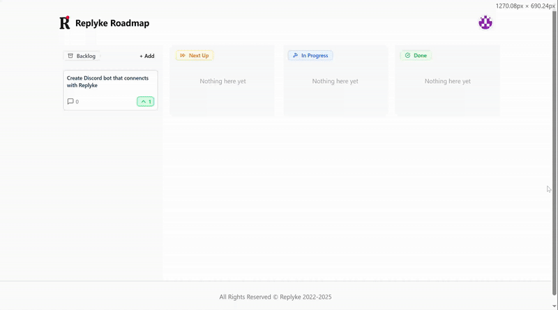

# Replyke - Roadmap Component

A plug-and-play roadmap component built with [Replyke](https://replyke.com), allowing teams to share product development progress, collect feedback, and prioritize what's next—all in one place.

---

## 🚀 Overview

This package provides a simple yet powerful roadmap UI with four stages: **Backlog**, **Next**, **In Progress**, and **Done**. It supports commenting, voting, and content moderation, with role-based access control via the Replyke platform.

Ideal for SaaS products, internal tools, and any project needing a public or internal roadmap.


## Demo
See it in action for Replyke's actual [public roadmap.](https://roadmap.replyke.com/)



---

## 🧠 About Replyke

[Replyke](https://replyke.com) is a modular platform that enables developers to quickly integrate social and collaboration features like comments, votes, feeds, reports, and more.

This roadmap component leverages Replyke's core features:

- **Entities**: each ticket is an entity
- **Comments**: threaded discussion on tickets
- **Votes**: prioritize features with upvotes
- **Reports & Moderation**: ensure quality content
- **Role Management**: only admins can move tickets

---

## 📦 Installation

```bash
npm install @replyke/roadmap
# or
yarn add @replyke/roadmap
```

---

## 💡 Usage

```tsx
import { useEffect, useState } from "react";
import useAuth from "../hooks/useAuth";
import useAxiosPrivate from "../config/useAxiosPrivate";
import Roadmap from "@replyke/roadmap";

export default function HomePage() {
  const { client } = useAuth();
  const axios = useAxiosPrivate();
  const [signedToken, setSignedToken] = useState<string>();

  useEffect(() => {
    const handleSignJwt = async () => {
      if (!client) return;
      const response = await axios.get("/clients-auth/sign-jwt");
      setSignedToken(response.data);
    };

    handleSignJwt();
  }, [client, axios]);

  return (
    <div className="relative w-full flex-1 no-scrollbar flex justify-center pb-12">
      <div className="overflow-x-auto w-full max-w-5xl px-4 sm:px-6 md:px-8 lg:px-12">
        <Roadmap
          projectId={import.meta.env.VITE_PUBLIC_REPLYKE_PROJECT_ID}
          signedToken={signedToken}
        />
      </div>
    </div>
  );
}
```

### Required Props

- `projectId`: your Replyke project ID
- `signedToken`: a JWT signed by your backend to authenticate the logged-in user

See [Replyke documentation](https://docs.replyke.com) for how to set up user auth and sign tokens.

---

## 🔧 Features

- 🧾 4-stage roadmap: Backlog → Next → In Progress → Done
- 📝 Commenting and discussion on each ticket
- 👍 Voting system to prioritize work
- ⚠️ Built-in content reporting and moderation via Replyke dashboard
- 🔒 Admin-only controls for moving tickets

---

## 🛠 Customization

This package is ready to use out of the box, but developers who want full control can clone the source and modify the component as needed. Since it uses Replyke under the hood, most changes can be made with minimal backend configuration.

---

## 🤝 Contributing

Contributions are welcome! If you’d like to improve the UI, add features, or fix bugs:

1. Fork the repo
2. Make your changes
3. Open a pull request


---

## ✅ Final Notes

This component is built on the idea that collaboration with your users can drive better decisions. Let your users help shape what you build next—with just a few lines of code.

Happy building! 🚀

## License

This repository is open-source under the **MIT License**.

## Contributions

Contributions are welcome! If you'd like to improve the comment section or add new UI components, feel free to submit a pull request. Join the Replyke community and help build better social UI components!

## 📬 Support

For questions or support, visit the [Replyke documentation](https://docs.replyke.com), open an issue or reach out via the [Discord server](https://discord.com/invite/REKxnCJzPz).